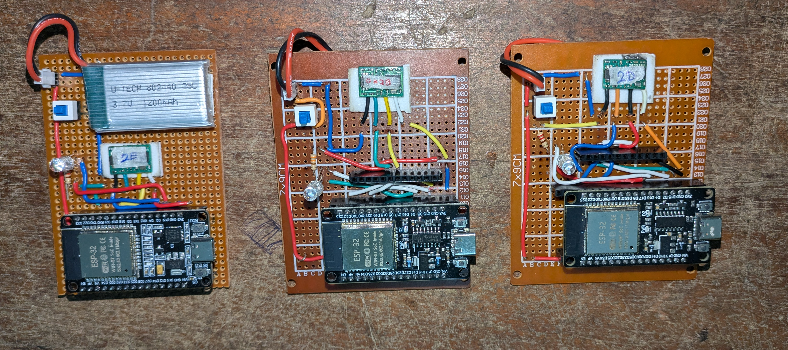
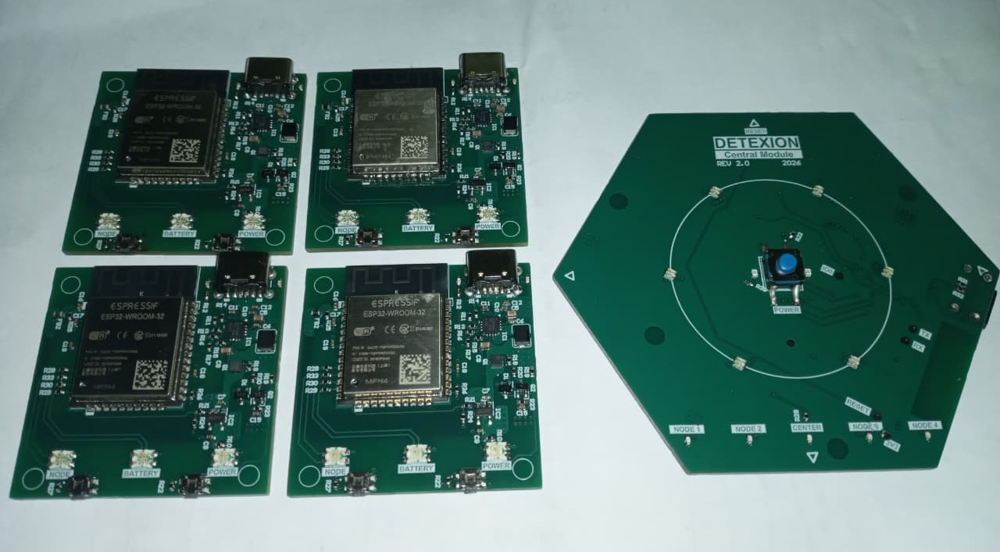

# Wearable IMU Network — Final Firmware

ESP32 firmware for the central module and four sensor nodes of a wearable motion-capture system developed for human activity reconstruction.

This repository contains the final firmware. The photographs below document the hardware's progression from early prototypes to the completed wearable system; prototype firmware is maintained separately.

## Project Overview

The system comprises a central module worn on the chest and four sensor nodes placed on the wrists and ankles. Each module uses an ESP32-WROOM-32 and a BNO085 IMU. Sensor nodes send motion data to the centre through an ESP-NOW star network. The centre collects the readings alongside its own sensor data and uploads them to Firebase for downstream processing and visualization.

## Hardware Development

### Prototype 1 — Dot-Board Implementation

Initial dot-board assembly used to develop and check sensor connections, embedded firmware, and wireless communication.

### Prototype 2 — First Custom PCB

The first custom-PCB stage brought the prototype circuitry onto a shared board design for hardware integration and further testing.

### Final Version — Wearable System

The final hardware uses separate central-module and sensor-node PCB designs, integrated with rechargeable batteries and enclosures for wearable operation.

## Firmware Features

| Feature | Central module | Sensor nodes |
| --- | --- | --- |
| BNO085 motion sensing through SPI | Chest motion data | Wrist or ankle motion data |
| ESP-NOW communication | Receives readings from four nodes | Transmits readings to the centre |
| Time synchronization | Coordinates synchronization | Participates in synchronization |
| Packet tracking | Device IDs, sequence numbers, timestamps, and checksum checks | Packet identification and integrity fields |
| Firebase integration | Uploads collected motion data | Data forwarded through the centre |
| BLE Wi-Fi provisioning | Configures cloud connectivity | Depends on the node firmware configuration |
| OTA updates | Wireless firmware maintenance | Wireless firmware maintenance |
| Battery and status monitoring | Local power and connection status | Local power and connection status |

Firmware is developed in Arduino C++ using FreeRTOS for task scheduling. Sensing, communication, uploading, and hardware-management functions are coordinated according to each module's role.

## Technologies

- **Microcontroller:** ESP32-WROOM-32
- **Motion sensor:** BNO085
- **Sensor interface:** SPI
- **Node communication:** ESP-NOW
- **Internet connectivity:** Wi-Fi
- **Cloud data pipeline:** Firebase
- **Configuration:** BLE-based Wi-Fi provisioning
- **Firmware:** Arduino C++ and FreeRTOS
- **Maintenance:** OTA firmware updates

## My Contribution

As the embedded system development lead, my work included:

- Defining system functionality and the requirements of the centre and sensor nodes.
- Developing basic circuit schematics and revising GPIO assignments across hardware development stages.
- Developing central-module and sensor-node firmware using Arduino C++ and FreeRTOS.
- Integrating BNO085 acquisition and evaluating BNO055 and MPU6050 sensors during development.
- Implementing ESP-NOW communication, packet tracking, and timestamp synchronization.
- Developing Firebase uploading, BLE Wi-Fi provisioning, and OTA update functionality.
- Integrating power-latch control, battery monitoring, buttons, and status LEDs.
- Assembling and testing dot-board prototypes, custom-PCB electronics, and the final wearable system.
- Evaluating orientation response, dynamic motion, stationary drift, and node-to-cloud communication.

## Testing and Outcome

Testing covered sensor initialization, orientation response, dynamic motion, stationary stability, synchronization, and communication from the nodes through the centre to Firebase. The completed prototype demonstrated wearable motion-data collection and wireless transfer, with an observed operating duration of approximately one hour.

## Potential Applications

- Movement assessment and rehabilitation monitoring
- Sports motion analysis
- Worker-safety monitoring
- Motion-driven character animation and virtual reality

These are potential applications of the prototype, rather than claims of clinical validation or production readiness.

## Firmware Setup

1. Select the central-module or sensor-node firmware appropriate to the hardware being programmed.
2. Install the dependencies referenced by that firmware and configure the ESP32 build environment.
3. Verify the GPIO mapping, node identifier, ESP-NOW peer addresses, and Wi-Fi channel against the actual hardware and network.
4. Supply the required Firebase and network configuration locally. Keep credentials out of the public repository.
5. Flash the initial firmware over USB and inspect the serial output to verify startup, sensor initialization, and communication.
6. Use OTA updates after the firmware's OTA and network configuration has been established.

<!-- Upload photos to an images folder beside this README using these exact names:
images/prototype1.png
images/prototype-2.jpg
images/final-version.jpg
If you use PNG files, update the image links above to match their extensions.
-->
